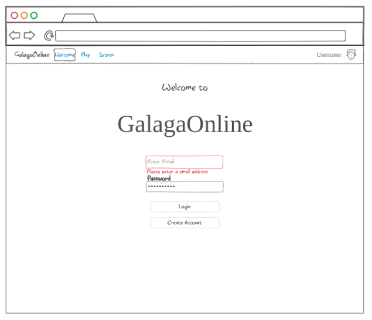
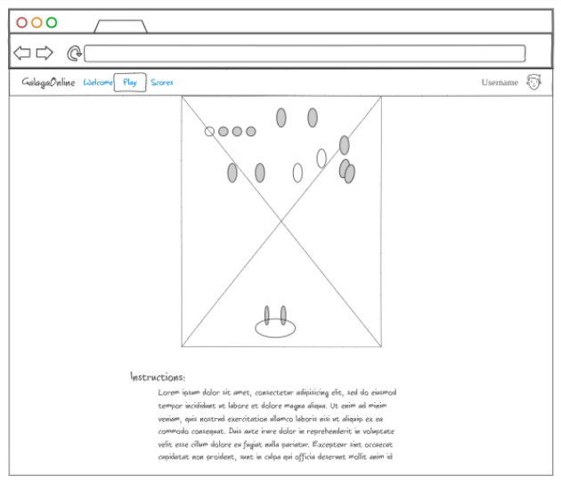

# Startup Project: GalagaOnline

## Elevator Pitch
Do you want to find out if you are the best Galaga player ever? This game is an endless space shooter game similar to Galaga but there is an online score leaderboard. You can compete with your friends to try to get the highest score. The high scores update live and you claim your high schore using your account so that you can clearly see who is winning in a close contest.

## Design
 

## Key Features
- Secure login over HTTPS
- Infinite Galaga Game
- Ability to Save and Update High Score
- Real-time Update of Leaderboard
- Instructions on How to Play
- High Score is Saved to Account

## Technologies

I will use the required technologies in the following ways.

- **HTML** - Uses correct HTML structure for application. Three HTML pages. One to login, one to play, and one for the leaderboard.
- **CSS** - Application styling and graphic background that looks good on different screen sizes, uses good whitespace, color choice and contrast.
- **JavaScript** - Provides login, the Galaga game, display scores for self and others, backend endpoint calls.
- **Service** - Backend service with endpoints for:
  - login
  - retrieving scores
  - submitting scores
  - retrieving leaderboard
- **DB/Login** - Store users, choices, and scores in database. Register and login users. Credentials securely stored in database. Can't save high score unless authenticated.
- **WebSocket** - As each user gets a new high score, their score is saved so all other users can see it on the leaderboard.
- **React** - Application ported to use the React web framework.

## HTML Deliverable

For this deliverable I built out the structure of my application using HTML.

- **HTML Pages** - 3 HTML pages to represent a welcome, play, and scores page
- **Links** - All pages have a header with links to all the other pages
- **Text** - There's an instructions, scores, and a welcome message displayed
- **Images** - The game is currently represented by an image of galaga
- **DB/Login** - There is a username and password field in the welcome page
- **WebSocket** - The leaderboard will update in real time

## CSS deliverable

For this deliverable I properly styled the application into its final appearance.

- **Header, footer, and main content body**
- **Navigation elements** - I made 3 buttons to navigate to different pages
- **Responsive to window resizing** - My app looks great on all window sizes and devices, even my phone!
- **Application elements** - Used good contrast and whitespace that is gray
- **Application text content** - Consistent fonts and good font sizing
- **Application images** - Image placeholder for the galaga game still looks great!

## JavaScript deliverable

For this deliverable I implemented JavaScript so that the application works for a single user. I also added placeholders for future technology.

- **login** - When you press enter or the login button it takes you to the voting page.
- **database** - Displayed the live high score and leaderboard. Currently this is stored and retrieved from local storage, but it will be replaced with the database data later.
- **WebSocket** - I used the setInterval function to periodically increase a high score. This will be replaced with WebSocket messages later.
- **application logic** - The high score updates when you get a new high score in the game if you run it locally. On the galagaonline.click website it isn't saving the score for some reason so I added manual entering the high score until I make the real galaga game.

## Service deliverable

For this deliverable I added backend endpoints that saves scores and provides the leaderboard.

- **Node.js/Express HTTP service** - done!
- **Static middleware for frontend** - done!
- **Calls to third party endpoints** - The background image calls NASA's astronomy picture of the day
- **Backend service endpoints** - Placeholders for login that stores the current user on the server. Endpoints for scores.
- **Frontend calls service endpoints** - I did this using the fetch function.

## DB/Login deliverable

For this deliverable I associate the scores with the logged in user. I stored the scores in the database.

- **MongoDB Atlas database created** - done!
- **Stores data in MongoDB** - done!
- **User registration** - Creates a new account in the database.
- **existing user** - Stores the high score under the same user if the user already exists.
- **Use MongoDB to store credentials** - Stores both user and their scores.
- **Restricts functionality** - You cannot play until you have logged in.

## WebSocket deliverable

For this deliverable I used webSocket to tell all players when somebody else beats their high score.

- **Backend listens for WebSocket connection** - done!
- **Frontend makes WebSocket connection** - done!
- **Data sent over WebSocket connection** - done!
- **WebSocket data displayed** - When somebody else gets a high score, you will get a popup telling you what they scored.

